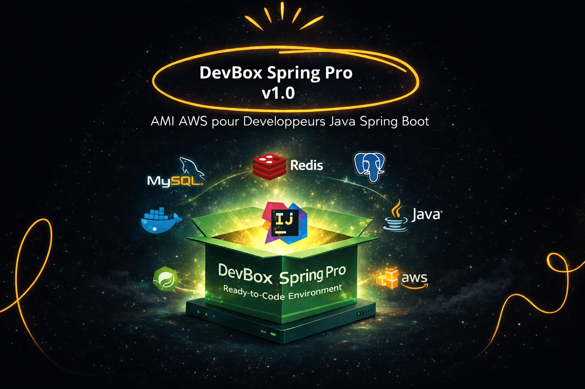
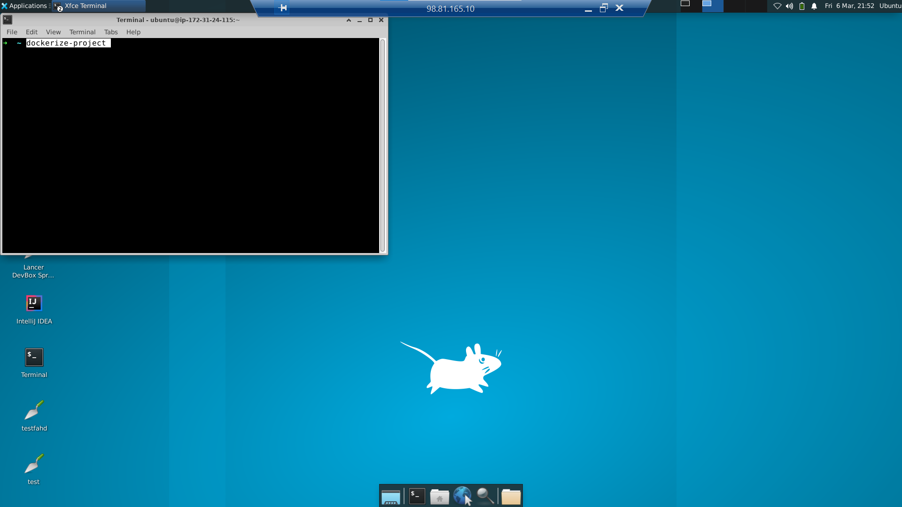
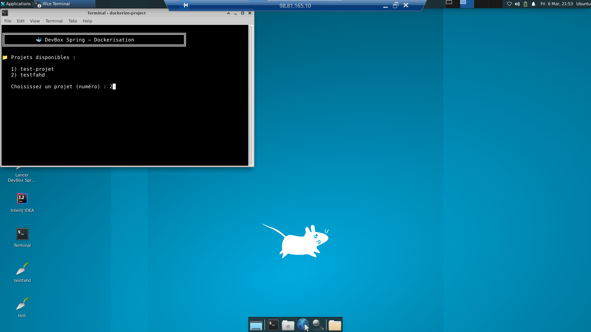
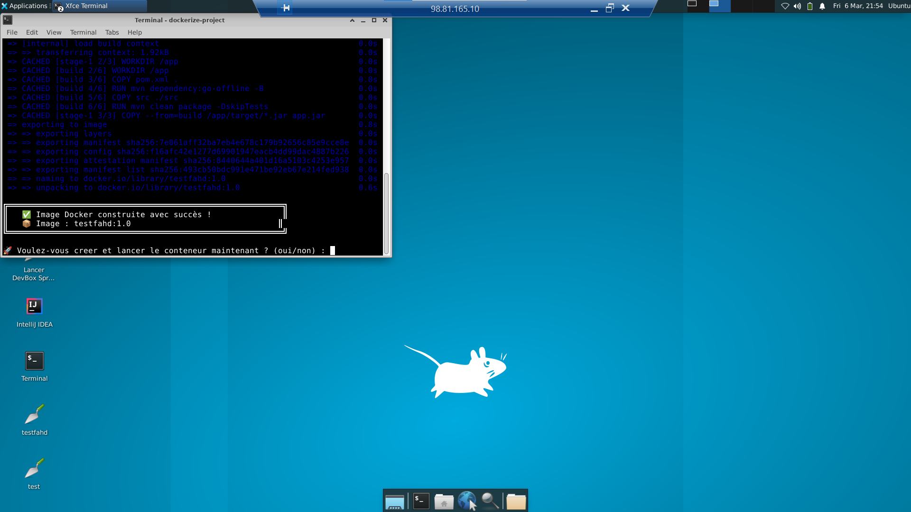
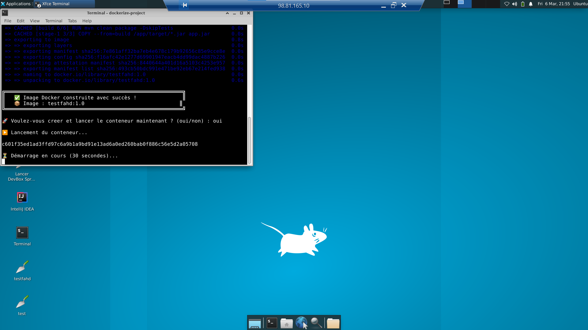
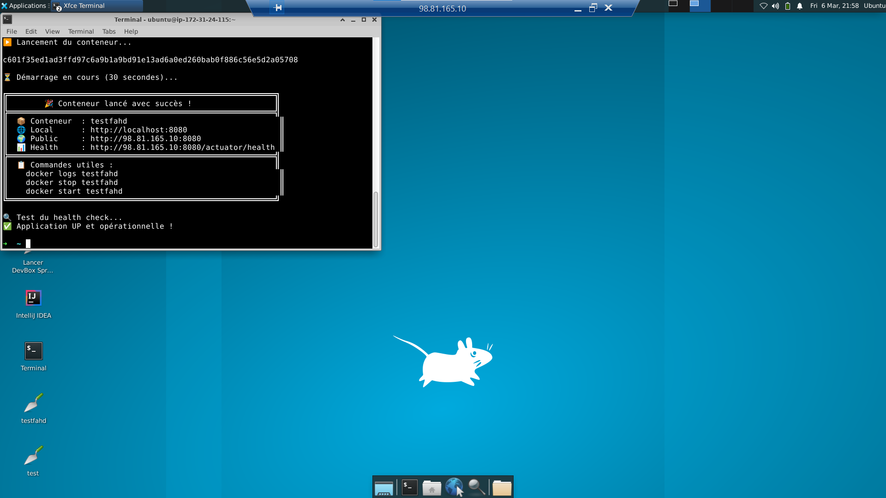
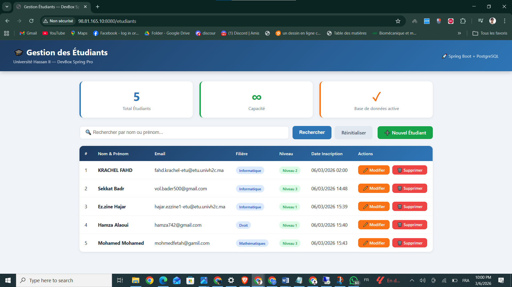
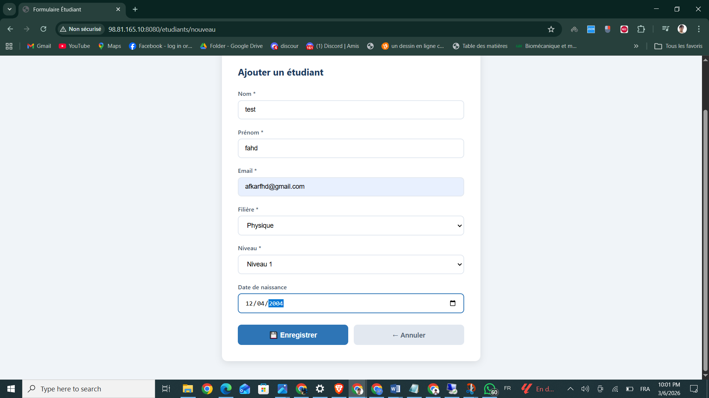
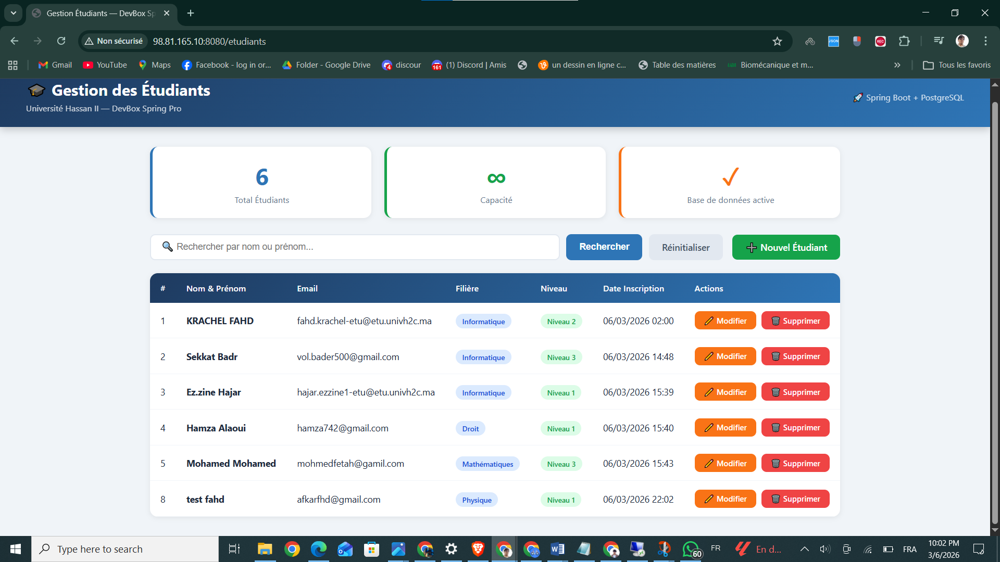

# DevBox Spring Pro

<div align="center">




**Une AMI AWS complète qui élimine toute la configuration et vous met au code immédiatement.**

[Voir la démo](#-démonstration-complète) • [Installation](#-comment-utiliser-lami) • [Fonctionnalités](#-fonctionnalités) • [Contact](#-auteur)

</div>

---

## 🤔 C'est quoi une AMI AWS ? (Pour les débutants)

Si vous n'êtes pas familier avec AWS, pas de panique !

> **AWS (Amazon Web Services)** est une plateforme cloud qui vous permet de louer des serveurs dans le cloud, accessibles depuis n'importe où dans le monde.

> **Une AMI (Amazon Machine Image)** c'est comme une **clé USB magique dans le cloud**. Imaginez que vous avez un ordinateur parfaitement configuré avec tous vos logiciels installés. Une AMI c'est une "photo" de cet ordinateur. En un clic, vous pouvez créer autant de copies identiques de cet ordinateur que vous voulez, en quelques minutes, depuis n'importe où.

**Sans AMI :** Vous louez un serveur vide et vous passez des heures à tout installer et configurer.

**Avec DevBox Spring Pro :** Vous lancez l'instance et vous commencez à coder immédiatement. Tout est déjà prêt.

---

## 🚀 C'est quoi DevBox Spring Pro ?

**DevBox Spring Pro** est une AMI AWS spécialement conçue pour les développeurs **Java Spring Boot**. Elle contient un environnement de développement complet, préinstallé et préconfiguré, accessible depuis votre PC Windows via une connexion bureau distant (RDP).

### Le concept en 3 étapes :

```
1️⃣  Lancez une instance EC2 depuis l'AMI        (2 minutes)
         ↓
2️⃣  Connectez-vous en bureau distant RDP        (30 secondes)
         ↓
3️⃣  Tapez create-spring-project et codez !      (30 secondes)
```

---

## ✨ Fonctionnalités

| Fonctionnalité | Description |
|---------------|-------------|
| 🖥️ **Bureau RDP complet** | Bureau Ubuntu accessible depuis Windows sans aucune installation |
| 🌿 **Script create-spring-project** | Génère un projet Spring Boot complet en 30 secondes |
| 🐳 **Script dockerize-project** | Dockerise et lance votre application en 1 commande |
| ☕ **Java 21 + Maven** | Langage et gestionnaire de dépendances préconfigurés |
| 💡 **IntelliJ IDEA** | IDE Java professionnel prêt à l'emploi |
| 🗄️ **PostgreSQL + MySQL + Redis** | 3 bases de données démarrées et configurées |
| ☁️ **AWS CLI + Docker** | Outils de déploiement cloud prêts |
| 🔒 **fail2ban + UFW** | Sécurité configurée par défaut |

---

## 🛠️ Outils préinstallés

| Outil | Version | Rôle |
|-------|---------|------|
| ☕ Java OpenJDK | 21.0.10 | Langage de programmation principal |
| 📦 Apache Maven | 3.6.3 | Gestion des dépendances Java |
| 🌿 Spring Boot CLI | 4.0.3 | Création rapide de projets Spring |
| 🐳 Docker | 29.3.0 | Conteneurisation des applications |
| ☁️ AWS CLI | 2.34.1 | Interaction avec les services AWS |
| 💡 IntelliJ IDEA | 2023.3 | IDE Java professionnel |
| 🖥️ XRDP | latest | Serveur bureau distant RDP |
| 🗄️ PostgreSQL | 14 | Base de données relationnelle |
| 🐬 MySQL | 8.0 | Base de données web |
| 🔴 Redis | 6.0 | Cache et sessions en mémoire |
| 🐘 Gradle | 8.6 | Outil de build alternatif |
| 🔒 fail2ban | 0.11.2 | Protection anti-brute force |

---

## 📸 Démonstration complète

### 1️⃣ Connexion Bureau Distant RDP depuis Windows

> Ouvrez **Remote Desktop Connection** (mstsc) sur Windows, entrez l'IP de votre instance et connectez-vous en quelques secondes. Aucune installation requise côté client.


---

### 2️⃣ Bureau distant Ubuntu — Environnement complet

> Une fois connecté, vous accédez à un bureau Ubuntu XFCE4 complet avec tous les raccourcis nécessaires : IntelliJ IDEA, Terminal, et vos projets directement accessibles sur le bureau.


---

### 3️⃣ Script create-spring-project — Projet en 30 secondes

> Tapez simplement `create-spring-project` dans le terminal. Le script vous pose 5 questions simples et génère automatiquement votre projet Spring Boot complet avec la base de données configurée, les dépendances ajoutées et un raccourci bureau créé.

```bash
create-spring-project
```


---

### 4️⃣ Projet ouvert dans IntelliJ IDEA

> Le projet généré s'ouvre directement dans IntelliJ IDEA. La structure complète est visible : entités, repositories, services, controllers et templates — tout est organisé professionnellement.


---

### 5️⃣ Configuration automatique des dépendances Maven

> IntelliJ détecte automatiquement le `pom.xml` et télécharge toutes les dépendances Spring Boot nécessaires. Zéro configuration manuelle requise.


---

### 6️⃣ Application CRUD — Gestion des Étudiants

> Exemple d'application complète développée avec DevBox Spring Pro : une API REST + interface web Thymeleaf pour la gestion des étudiants, connectée à PostgreSQL avec des opérations CRUD complètes.


---

### 7️⃣ Script dockerize-project — Dockerisation automatique

> Tapez `dockerize-project` dans le terminal. Le script détecte automatiquement votre projet, lit la configuration depuis `application.properties`, crée le Dockerfile et lance le build Docker.

```bash
dockerize-project
```



---

### 8️⃣ Sélection interactive du projet

> Si plusieurs projets existent dans `~/projects`, le script affiche une liste numérotée et vous demande de choisir. Aucune commande complexe à mémoriser.



---

### 9️⃣ Build Docker réussi

> Le script affiche la progression du build en temps réel. Une fois terminé, il vous demande : **"Voulez-vous créer et lancer le conteneur maintenant ?"**



---

### 🔟 Création et lancement du conteneur

> En répondant `oui`, le script crée automatiquement le conteneur avec les bonnes variables d'environnement, le réseau configuré et l'option `--restart always` pour un redémarrage automatique.



---

### 1️⃣1️⃣ Conteneur lancé avec succès

> Le script vérifie automatiquement que le conteneur tourne et affiche les URLs d'accès : local et public avec le health check.



---

### 1️⃣2️⃣ Accès depuis le navigateur

> L'application est accessible publiquement depuis n'importe quel navigateur via `http://VOTRE_IP:8080`.



---

### 1️⃣3️⃣ Test — Formulaire d'ajout d'un étudiant

> Démonstration du formulaire d'ajout d'un étudiant. Remplissez les champs nom, prénom, email, filière et niveau — puis validez.



---

### 1️⃣4️⃣ Résultat — Étudiant ajouté avec succès

> L'étudiant apparaît immédiatement dans le tableau après soumission du formulaire. Les données sont persistées dans PostgreSQL en temps réel.



---

## 🖼️ L'AMI DevBox Spring Pro sur AWS

> Voici l'AMI disponible dans la console AWS EC2. Elle contient l'environnement complet prêt à être lancé en quelques clics.


---

## 🚀 Comment utiliser l'AMI

### Prérequis
- Un compte AWS (Free Tier compatible)
- Windows avec Remote Desktop Connection (déjà installé sur Windows)
- C'est tout ! Aucun autre logiciel nécessaire.

### Étape 1 — Lancer l'instance EC2

```
AMI ID  : ami-0263717cabe29da71
Région  : us-east-1 (Virginie du Nord)
Type    : t2.medium (recommandé)
Ports   : 22, 80, 8080, 3389
```

### Étape 2 — Connexion RDP

```
Windows + R  →  mstsc
Ordinateur   :  VOTRE_IP_EC2:3389
Utilisateur  :  ubuntu
Mot de passe :  fahd2026
```

### Étape 3 — Créer votre premier projet

```bash
create-spring-project
```

### Étape 4 — Lancer l'application

```bash
cd ~/projects/mon-projet
mvn spring-boot:run
```

### Étape 5 — Dockeriser en 1 commande

```bash
dockerize-project
```

---

## 🔐 Informations de connexion

| Service | Utilisateur | Mot de passe | Port |
|---------|-------------|--------------|------|
| Bureau RDP | ubuntu | fahd2026 | 3389 |
| PostgreSQL | devbox | devbox123 | 5432 |
| MySQL | devbox | devbox123 | 3306 |
| Redis | — | — | 6379 |
| Spring Boot | — | — | 8080 |

> ⚠️ **Changez les mots de passe après la première connexion !**

---

## 🔄 Pipeline complet

```
👨‍💻  create-spring-project    →   Projet généré automatiquement
         ↓
💡  IntelliJ IDEA             →   Codez votre application
         ↓
▶️   mvn spring-boot:run      →   Testez localement
         ↓
🐳  dockerize-project         →   Conteneurisé en 1 commande
         ↓
🌍  http://VOTRE_IP:8080      →   Application accessible publiquement !
```

---

## 🗺️ Feuille de route — Version 2.0

- [ ] Intégration Kafka pour microservices
- [ ] Support Kubernetes (EKS)
- [ ] Pipeline CI/CD avec GitHub Actions
- [ ] Monitoring avec Prometheus + Grafana
- [ ] Déploiement automatique sur ECS Fargate

---

## 👨‍💻 Auteur

**Fahd Krachel**
Étudiant en Informatique — Université Hassan II Casablanca

[](https://linkedin.com/in/fahd-krachel)
[](https://github.com/fahd-krachel)

📧 fahd.krachel@etu.univh2c.ma

---

## 📄 Droits d'auteur

```
© 2026 Fahd Krachel — Tous droits réservés.

Ce projet est partagé à titre de démonstration uniquement.
Toute reproduction, distribution, modification ou utilisation
commerciale est strictement interdite sans autorisation écrite
de l'auteur.
```

---

<div align="center">


⭐ **Si ce projet vous a aidé, donnez-lui une étoile sur GitHub !** ⭐

</div>
